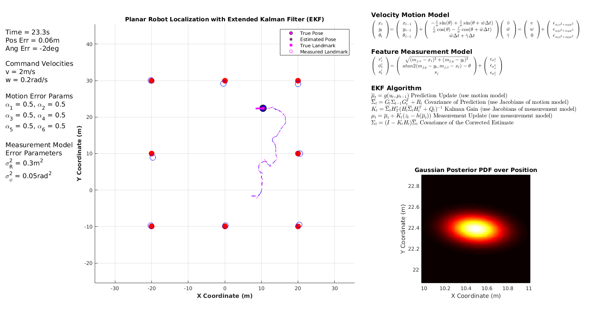

# Planar Robot Localization with the Extended Kalman Filter

## Getting Started
These two files demonstrate the application of the Extended Kalman Filter to localization of a planar robot.
Breifly, the planar robot state-space is (x,y,theta) in an environment with landmark features existing at (x,y) points. 
It experiences random perturbations both in the motion it undergoes, and in the measurements it collects.
Therefore, *optimal* estimation combines a priori known motion/measurement models and error parameters to minimize the expected squared error between the true state and estimate of it.
For a rigorous description of this algorithm as well as aggregate simulation results, please read the document, *EKFLocalization.pdf*.
Next, download this repository to any directory on you machine. 

### Prerequisites

This software was developed on Matlab 2016, and requires the *Statistics and Machine Learning Toolbox*.

### Installing
No additonal installation procedures are required.

## Running the tests

Open Matlab. 
Navigate the *Current Folder* pane to the root directory of this repository. 
Run 'mainEKFLocalization.m'.
This entry point function will initialize the robot and environment state parameters and will orchestrate the discrete time simulation.
On each simulation iteration, the underlying 'EKFLocalization.m' function in invoked to produce the latest posterior density of state.

### Example Output
Shown below is an example snapshot of the random dynamic simulation which unfolds.
The left hand column describes the applied simulation parameters. 
These include the applied motion commands, and the error parameters associated with motion commands and measurements.
The large white square depicts the motion of the planar robot as well as the associated observer-estimate of state.
The equations governing motion and measurement processes are shown on the top left.
The Gaussian posterior density of the planar robot position (the third angle dimension is not shown) is depicted on the botton left.

## References
Thrun S, Burgard W, Fox D. (2005). [*Probabilistic Robotics*](http://www.probabilistic-robotics.org/), Intelligent Robotics and Autonomous Agents. MIT Press.

## License

This project is licensed under the MIT License - see the [LICENSE.md](LICENSE.md) file for details

